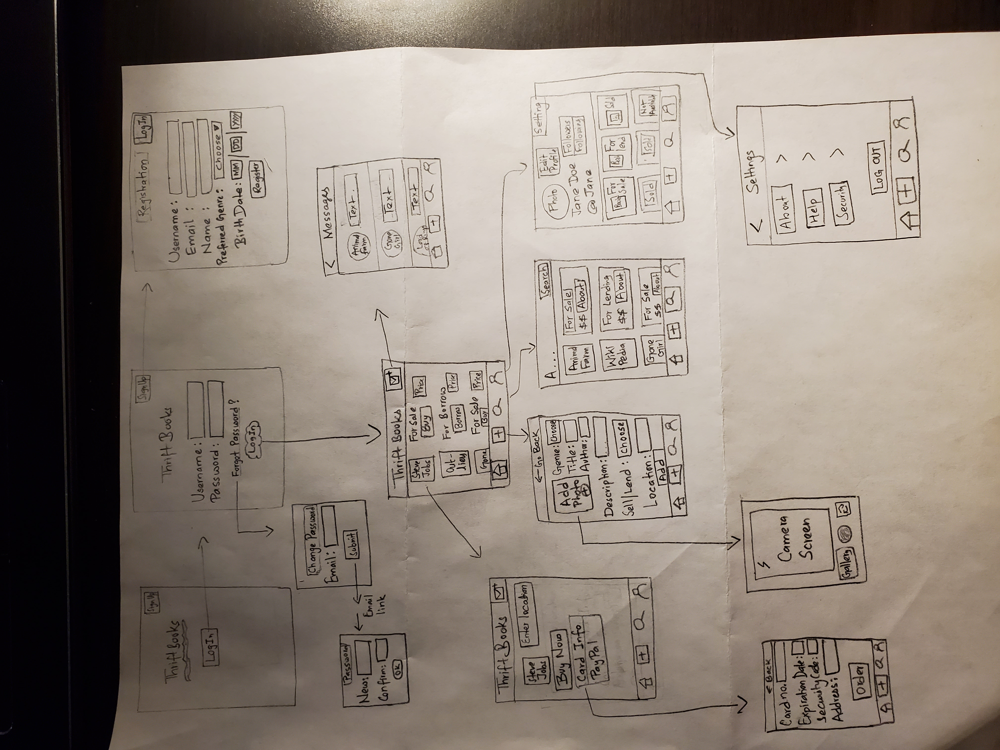
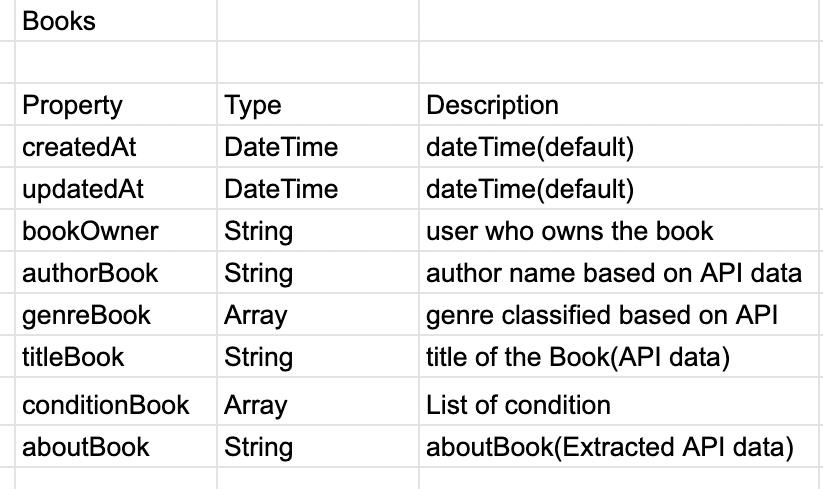
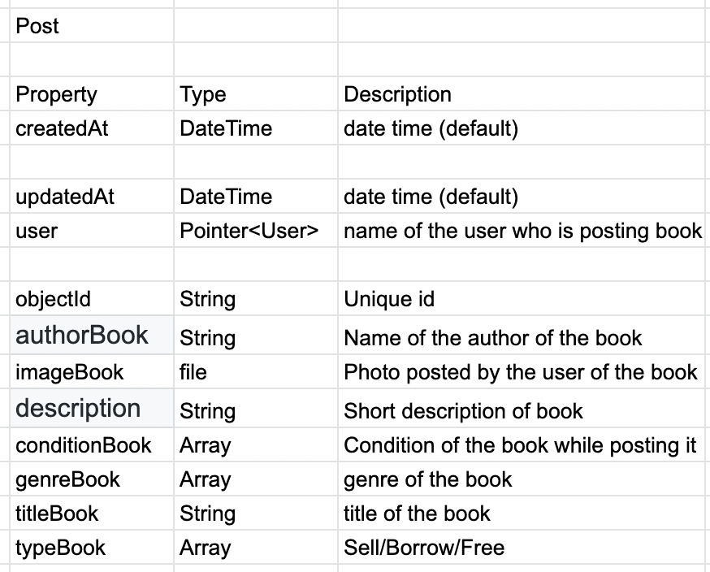
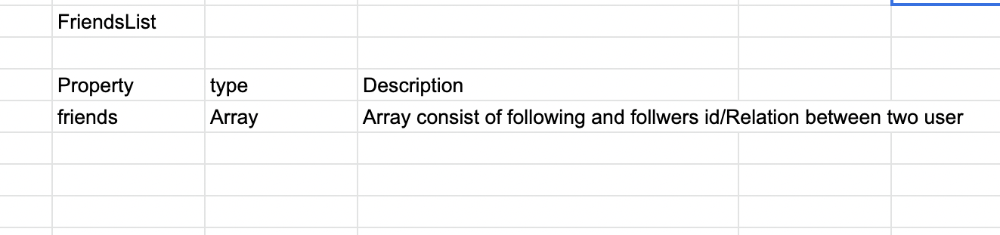

# Capstone-ProductSpec

#App 1 - ThriftBooks

Original App Design Project - README Template
===

# APP_NAME -  ThriftBooks

## Table of Contents
1. [Overview](#Overview)
1. [Product Spec](#Product-Spec)
1. [Wireframes](#Wireframes)
2. [Schema](#Schema)

## Overview
### Description
ThriftBooks can be useful for people who want to sell, borrow, buy used books. Users can post new books and keep it either for sell or borrowing. People can follow each other and see if the people they are following have posted a new book. App is mainly targeted for the people who generally love reading books and like sharing books.

### App Evaluation
[Evaluation of your app across the following attributes]
- **Category:** LifeStyle/Educational
- **Mobile:** App can be used on mobile or can also be used on web like most of the apps. Similar features on mobile and web. Mobile has more features.
- **Story:** User post picture of the book for sell, borrow. Also, the user can see posts of other people they are following. 
- **Market:** Can be used by people who can buy or is willing to sell used books.For security reasons, the person should be of certain age category.
- **Habit:** User can use to often or unoften depending on reading habits of a person. 
- **Scope:** People can use it as a platform to sell, give away or buy used books easily. 

## Product Spec

### 1. User Stories (Required and Optional)

**Required Must-have Stories**

* User register for an account and log in to post books.
* User picks their favorite genre of book - fictional/non fictional/ educational
* Compose page to post their books 
* User can take picture of book and write all requirements and post it.
* Stream page to show other accounts they are following
* Has user profile for each user 
* Settings (General, Logout) --- (Carts, Orders and Payment methods - Optional)

**Optional Nice-to-have Stories**

* Favorites - User can save books to favorites to buy later 
* About us page
* Help 
* Past bought books orders

### 2. Screen Archetypes

* Register for account
   * Login
* Login 
   * Confirm email address
* Stream
   * Can see guide post with the example of a posted picture of book (first time user)
   * Click on guide for onboarding (first time user)
   * Search for genres of book or name of books to buy/borrow 
   * Compose a post to sell a book
   * Get notify if you get the free book on FreeBook Notifier Screen
* Free Book Screen
   * Scroll through for free books and apply to get one 
   * See the list of user name who has requested for the free book you are giving away
* Profile Screen
   * Make Profile by going into creating profile page
   * Change username (optional)
* Setting Screen
   * Logout
 
### 3. Navigation

**Tab Navigation** (Tab to Screen)

* Stream (main screen)
* Profile
* FreeBook Notifier Screen
* Setting

**Flow Navigation** (Screen to Screen)

* Guided to Login page
   * Register for a account in case user doesn't have 
* Register
   * Login
* Login
   * Few the Stream
   * Search for book/genre/following 
* Search Bar
   * Get Results for books under two category (for sale, for borrow)
     * For Borrow
       * Top result of book for generous book aka with the most followers and books available in the nearest location
       * Go to the about page of the book 
       * Instant messaging to ask more about the book
       * Borrow book 
       * Get waitlisted if book not available (Optional)
     * For sale 
       * Top result of book for good booksellers aka with the most followers and books available in the nearest location
       * Go to the about page of the book
       * Message to ask more about the book 
       * Buy the book
       * Get waitlisted if book not available (Optional)
 * FreeBook Notifier 
   * Get post if someone has posted giveaway (free book) based on the genre you have chosen 
   * Posts are catgorized according to three main genres - Fiction/Non-fiction/Educational(Textbooks)
## Wireframes
[Add picture of your hand sketched wireframes in this section]

### [BONUS] Digital Wireframes & Mockups

### [BONUS] Interactive Prototype

## Schema 
[This section will be completed in Unit 9]
### Models
[Add table of models]

### Networking
- [Add list of network requests by screen ]
- [Create basic snippets for each Parse network request]
- [OPTIONAL: List endpoints if using existing API such as Yelp]
